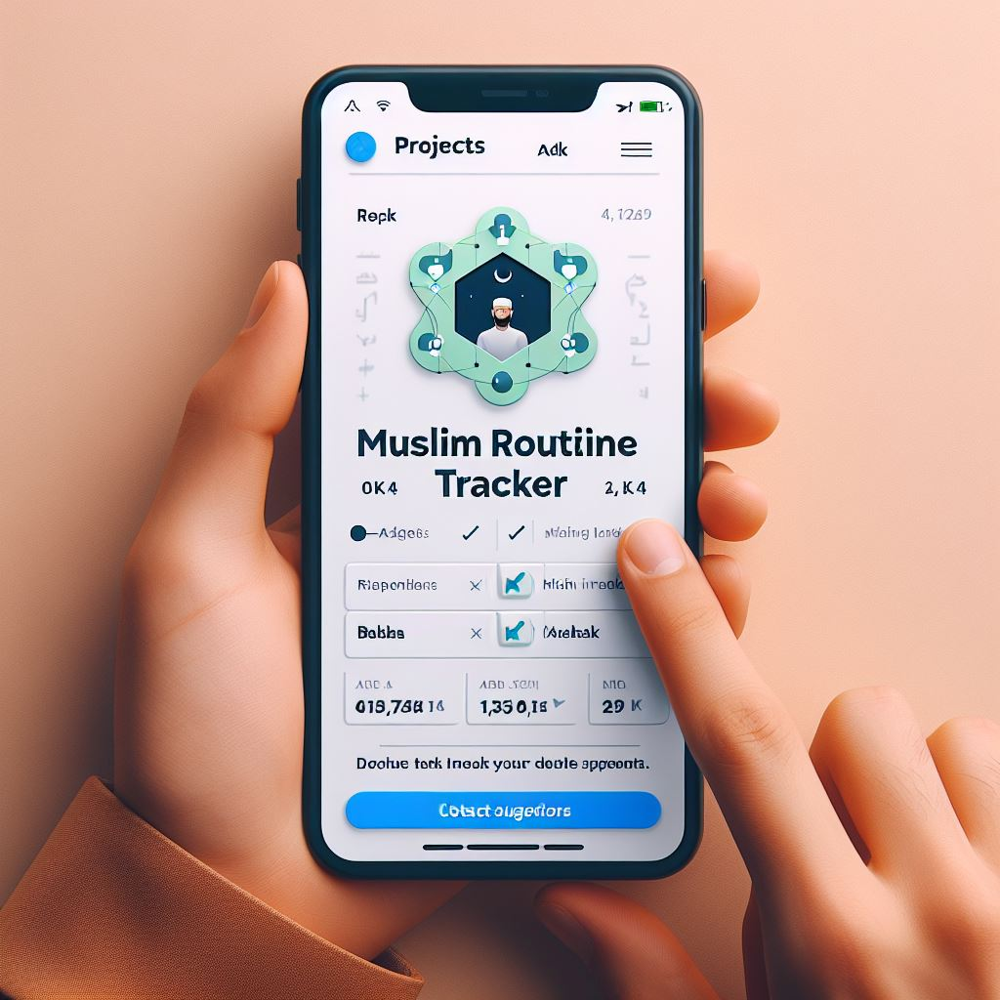
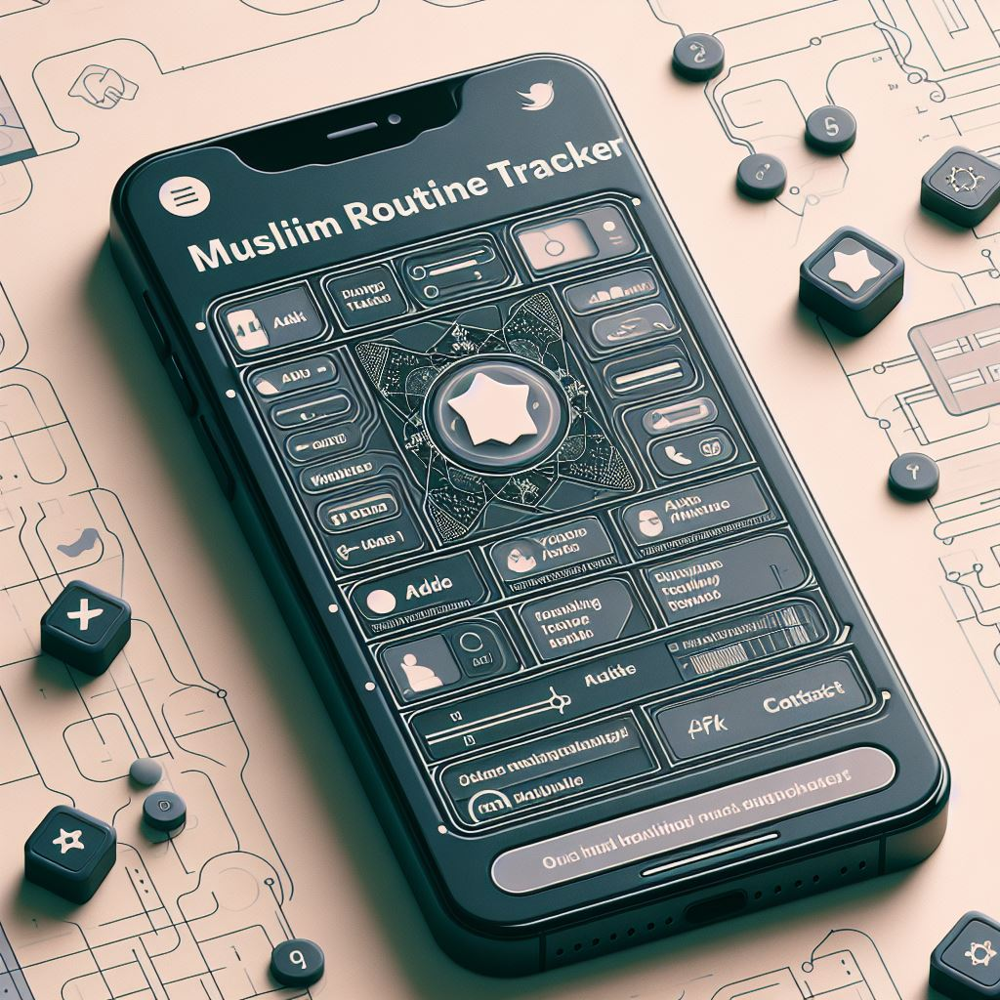

# Muslim Routine Tracker

Muslim Routine Tracker is a React web application designed to help Muslims track and manage their daily religious practices and routines. It allows users to add, delete, and mark tasks or Ibaadas as completed. Additionally, the app provides a contact form for users to reach out or provide suggestions.

## [Live Link](https://muslimroutine-tracker.netlify.app/)

## Preview

  
  
  

## Table of Contents
- [Project Overview](#project-overview)
- [Technical Details](#technical-details)
- [Features](#features)
- [Installation](#installation)
- [Usage](#usage)
- [Configuration](#configuration)
- [Contributing Guidelines](#contributing-guidelines)
- [Contact](#contact)

## Project Overview
Muslim Routine Tracker is aimed at providing Muslims with a convenient tool to manage their daily religious routines and practices. It caters to users who wish to organize their Ibaadas efficiently while offering features such as daily Ahadith Nabawiya and easy task management.

## Technical Details
- **React Usage:** Utilizes React components and hooks for building a dynamic user interface.
- **Sass Implementation:** Utilizes Sass for styling, leveraging its features like variables and mixins for maintainable and scalable styles.
- **Animations:** Utilizing CSS animations, GSAP, and React Spring, dynamic motion enhances user experience with seamless transitions and captivating effects.
- **Responsive Web Design:** Implements responsive layouts using media queries to ensure optimal viewing experience across various devices.

## Features
1. **Bio with Ahadith Nabawiya:** Displays a section with daily or random Ahadith Nabawiya for users' spiritual enrichment.
2. **Login and Register:** Users can create an account and log in to access personalized features.
3. **Progress Line for Completed Tasks:** Visual representation of the user's progress in completing tasks.
4. **Change Day Using Calendar:** Allows users to navigate between different days to view and manage tasks.
5. **Download All Tasks as CSV or Excel:** Provides an option to download all tasks or Ibaadat added in a CSV or Excel format for offline reference.
6. **Add a Ibaada or a task:** Users can add new tasks or Ibaadas.
7. **Delete a Ibaada or a task:** Users can remove existing tasks or Ibaadas.
8. **Finish a task by clicking on it:** Tasks can be marked as completed by clicking on them.
9. **Checkbox for Each Task:** Allows users to easily mark tasks as completed or incomplete.
10. **Task Status Options:** Users can categorize tasks as "done on time (تم في وقته بحمد الله)," "done later (قضيته بحمد الله)," or "not done (لم يتم للأسف)."
11. **Delete Current Task:** Option to delete a task from the list.
12. **Add a New Task:** Users can add new tasks or Ibaadat to their routine.
13. **Contact or adding a suggestion:** Provides a contact form or suggestion box for users to communicate and provide feedback.

## Installation
1. Clone the repository: `git clone https://github.com/MMansy19/Muslim-Routine-Tracker/`
2. Install dependencies: `npm install`
3. Start the development server: `npm start`

## Usage
- Upon running the development server, the app can be accessed in your web browser at `http://localhost:3000`.
- Use the interface to add, delete, and mark tasks or Ibaadas as completed.
- Navigate to the contact section to provide feedback or suggestions.

## Configuration
Include any information about configuring your project, such as setting up environment variables or other configuration options.

## Contributing Guidelines
Encourage contributions from other developers by outlining guidelines for submitting bug reports, feature requests, or pull requests. Include information on how to set up a development environment and guidelines for coding style and commit messages.

## Contact

- [Author](https://github.com/MMansy19)
- [Website](https://mahmoud-mansy-portfolio.netlify.app/)
- [Email](mailto:mahmoud2abdalfattah@gmail.com)
- [LinkedIn](https://www.linkedin.com/in/mahmoud-mansy-a189a5232)

